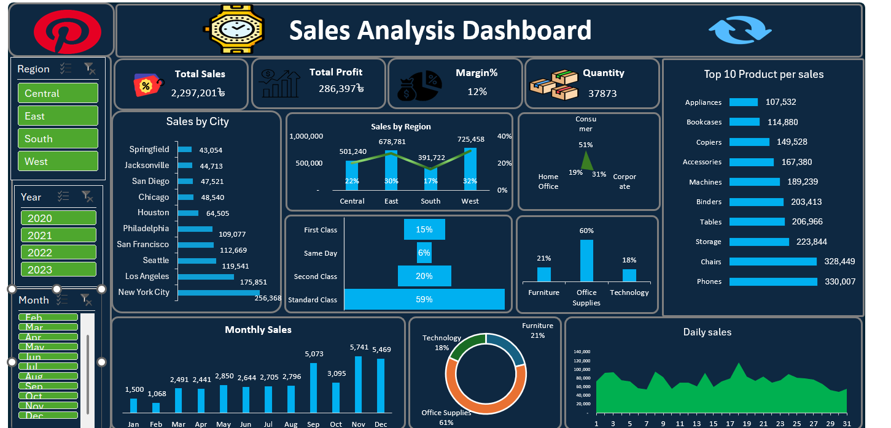

# 📊 Sales Analysis Dashboard (Excel Project)

## 🧾 Project Overview
This project is an **Interactive Sales Analysis Dashboard** built in **Microsoft Excel**, designed to analyze and visualize business sales performance across multiple regions, years, and product categories.  

The dashboard provides key metrics such as **Total Sales, Profit, Margin %, Quantity Sold**, and detailed insights by **Region, City, Category, and Product** — helping stakeholders make data-driven business decisions.

---

## 🚀 Key Insights
- 💰 **Total Sales:** 2,297,201৳  
- 📈 **Total Profit:** 286,397৳  
- 📊 **Average Margin:** 12%  
- 🛒 **Total Quantity Sold:** 37,873 Units  
- 🌍 **Top Region:** West (725K+ Sales)  
- 🏙️ **Top City:** New York City (256K+ Sales)  
- 📦 **Top Product:** Phones & Chairs  
- 👥 **Top Customer Segment:** Consumer (51% of Total Sales)  
- 🚚 **Top Shipping Mode:** Standard Class (59%)  
- 📅 **Peak Month:** October  

---

## ⚙️ Tools & Techniques Used
| Tool | Purpose |
|------|----------|
| **Microsoft Excel** | Data Cleaning, Analysis & Visualization |
| **Pivot Tables** | Dynamic data summarization |
| **Slicers & Timelines** | Interactive filtering by Region, Year & Month |
| **Charts & KPIs** | Visual representation of key metrics |
| **Conditional Formatting** | Highlighting performance trends |

---

## 📂 Dashboard Features
✅ Dynamic filters for **Region**, **Year**, and **Month**  
✅ Interactive **charts** (bar, line, donut, funnel)  
✅ KPI cards for **Sales, Profit, Margin%**, and **Quantity**  
✅ **Top 10 Product** and **Sales by Region/City** views  
✅ Clean, professional layout suitable for **business reporting**

---

## 📸 Dashboard Preview

---

## 🧠 Learnings & Takeaways
- Improved data storytelling using Excel visualization tools  
- Strengthened skills in KPI design and dashboard layout  
- Learned how to turn raw sales data into meaningful business insights  

---

## 📈 Future Improvements
- Automate dashboard refresh using **Power Query**  
- Integrate with **Power BI** for advanced visuals  
- Add forecast and trend analysis with Excel formulas  

---

## 💡 About the Author
**Md Bijoy Hossen** — Data Analyst | Excel | SQL | Power BI | Python  
Passionate about transforming raw data into actionable insights.  

---

### ⭐ If you like this project, consider giving it a star!
